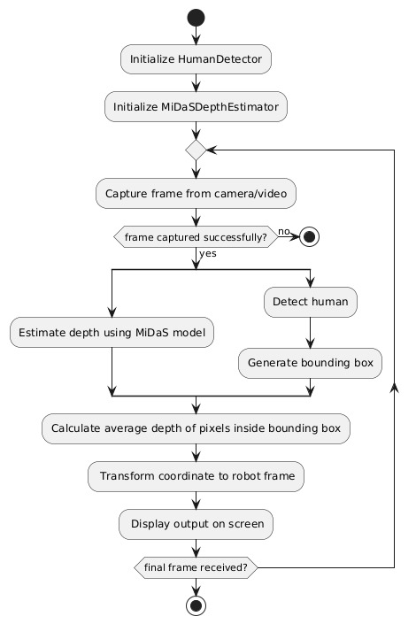

# ENPM700-Midterm course project 

## Topic: Human Object detection and tracking using monocular camera

# C++ Badges
  

## Overview

Course: Software Development for Robotics
Code: ENPM700
Semester: Fall 2024
Team members: 
        1. [Keyur Borad](https://github.com/keyurborad5) 
        2. [FNU Koustubh](https://github.com/koustubh1012) 
        3. [Swaraj Mundruppady Rao](https://github.com/SwarajMundruppadyRao)
School: University of Maryland, College park

## Background
Acme Robotics is launching a brand new robotics-based product next year but their small development team is falling behind. They’ve reached out to out team to help them get back on track.

Our task is to design a perception module of their robotics-based components using high-quality software engineering practices so their team can take our deliverable, finish development and integrate it into the product.

## Initial proposal

## Activity Diagram

## Class Diagram

## Initial Product Backlog
https://docs.google.com/spreadsheets/d/1fh9gBtK0hcLDP9B47O9Ribjl_y3yS_IEFFMDYh72blE/edit?gid=0#gid=0

## Quadchart

## Video of our proposal

